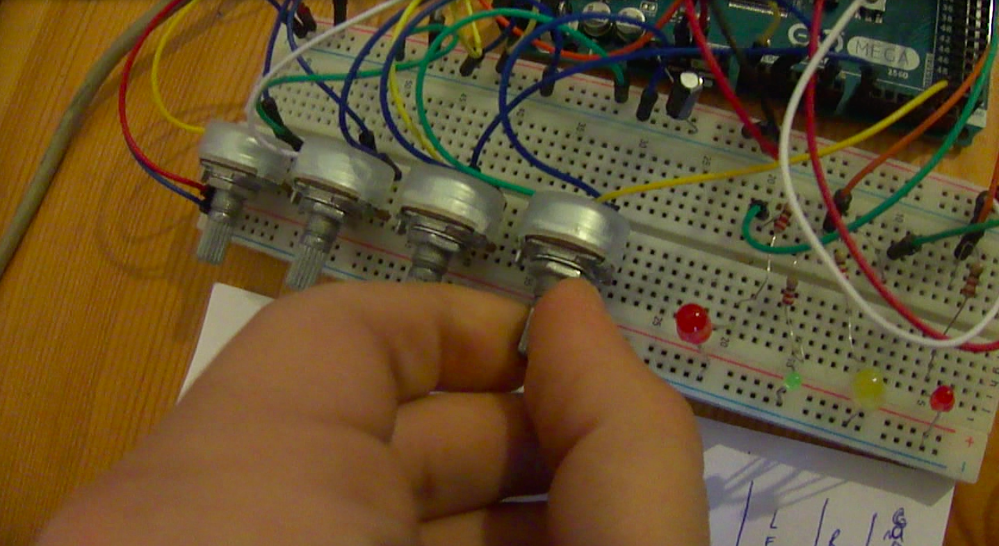

# ISEP's water supply management system
A project implementing some small circuitry to convert the chosen sensors’ output to a Arduino MEGA that would control the  entire system.
Please refer to “Requirements” and to the “Article” to learn more about the project.

  

<h2> Demonstrative video</h2>

